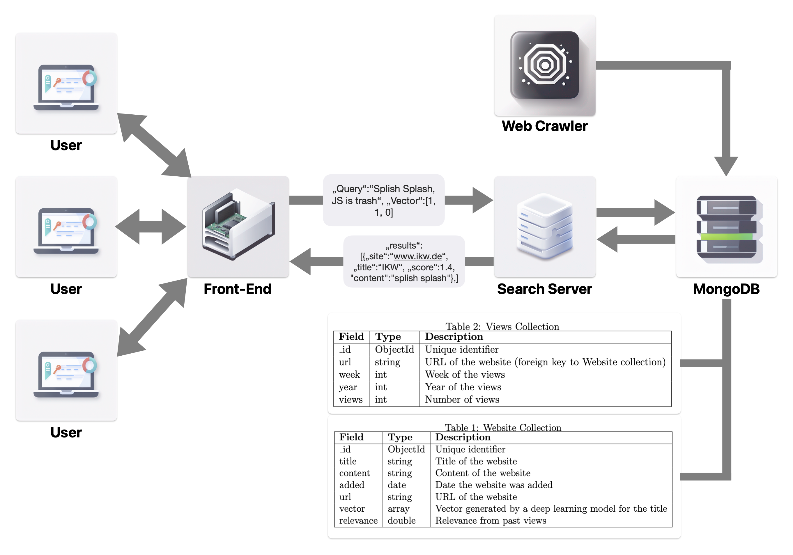

# Search Frontend Server
## Project for AI and the Web
This is a simple Flask application that provides two endpoints to search for similar websites based on vector similarity and to update the number of views for a website. It utilizes MongoDB for data storage and retrieval. This project was part of the course "AI and the Web" at Osnabrück University.

(<a href="#top">back to top</a>)

## 📖 Table of Contents
- [Search REST API Server](#search-rest-api-server)
  - [Project for AI and the Web](#project-for-ai-and-the-web)
  - [📖 Table of Contents](#-table-of-contents)
  - [❓ Why?](#-why)
  - [✨ Features of the Front-end](#-features-of-the-front-end)
  - [💻 Usage](#-usage)
  - [💾 Structure](#-structure)
  - [🚫 Limitations](#-limitations)
  - [📝 Authors](#-authors)
  - [📎 License](#-license)

## ❓ Why?
To distribute the load of handeling user requests and doing the actual rankings of websites, we decided to split the search process in different application. On the one hand, there is the server that handles incoming requests and calculates the vectors. On the other hand, there is the application which has been implemented in this repo, which loads the existing website data from a MongoDB database and matches the entries in this database with the user query, to return optimal results. Lastly there is the web crawler that updates the search index database.
  

 

  

(<a href="#top">back to top</a>)

## ✨ Features of the Front-end

(<a href="#top">back to top</a>)

## 💻 Usage

(<a href="#top">back to top</a>)

## 💾 Structure
<!-- Project Structure -->

    .
    │── graphics
    │     └── SearchEngine.png
    │── static
    │     ├── Views.bson           # Example data for the views table
    │     └── Website.bson         # Example data for the Website table
    │── templates
    │     ├── Views.bson           # Example data for the views table
    │     └── Website.bson         # Example data for the Website table
    │── README.md
    │── requirements.txt
    │── commands.txt               # Commands to set up the database
    │── relevance.py               # Contains the calculations for the view based relevance
    └── server.py                  # The file containing the actual server

(<a href="#top">back to top</a>)

## 🚫 Limitations
Efficiently managing server loads is a critical aspect of web service optimization. One approach to achieve better load management is to assign specific clusters of websites to individual servers. By leveraging unsupervised clustering techniques on the vector representations of websites stored in the database, we can group similar websites together. Each server would then be responsible for serving requests related to websites within its designated cluster. This strategy ensures that servers are specialized in handling a specific subset of websites, minimizing the risk of overloading and optimizing resource utilization. Additionally, it enhances response times for users as they are directed to servers tailored to their search context. Such an approach not only improves server load management but also enhances the overall performance and scalability of the web service. But due to the scope of the project, this feature was not implemented.

(<a href="#top">back to top</a>)

## 📝 Authors
[Jonah Schlie](mailto:jschlie@uni-osnabrueck.de) (main maintainer of the repo) 
[Cornelius Wolff](mailto:cowolff@uos.de) 
[Christine Arnoldt](mailto:carnoldt@uni-osnabrueck.de) 

(<a href="#top">back to top</a>)

## 📎 License
Copyright 2022 Cornelius Wolff, Christine Arnoldt, Jonah Schlie

Licensed under the Apache License, Version 2.0 (the "License");
you may not use this file except in compliance with the License.
You may obtain a copy of the License at

    http://www.apache.org/licenses/LICENSE-2.0

Unless required by applicable law or agreed to in writing, software
distributed under the License is distributed on an "AS IS" BASIS,
WITHOUT WARRANTIES OR CONDITIONS OF ANY KIND, either express or implied.
See the License for the specific language governing permissions and
limitations under the License.

(<a href="#top">back to top</a>)

